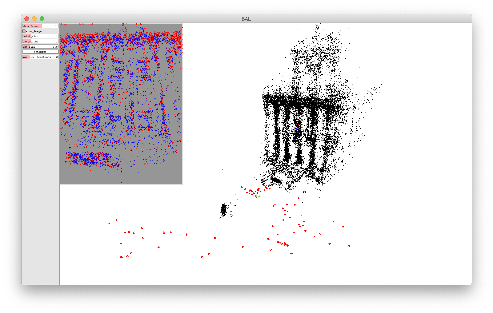
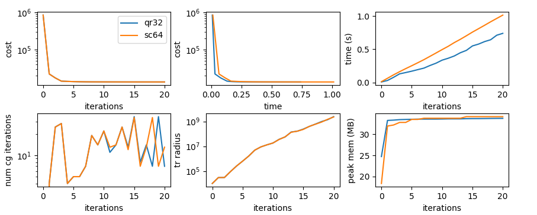
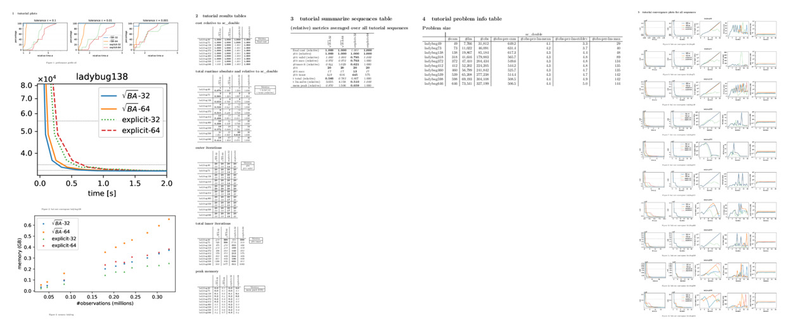

# RootBA: Square Root Bundle Adjustment

[Project Page](https://go.vision.in.tum.de/rootba) | 
[Paper](https://arxiv.org/abs/2103.01843) | 
[Poster](https://vision.in.tum.de/_media/research/vslam/rootba/demmel2021cvpr_rootba_poster.pdf) |
[Video](https://youtu.be/kAhmjNL8B-U) |
[Code](https://github.com/NikolausDemmel/rootba)


## Citation

If you find our work useful in your research, please consider citing:

```
@inproceedings{demmel2021rootba,
 author = {Nikolaus Demmel and Christiane Sommer and Daniel Cremers and Vladyslav Usenko},
 title = {Square Root Bundle Adjustment for Large-Scale Reconstruction},
 booktitle = {IEEE Conference on Computer Vision and Pattern Recognition (CVPR)},
 year = {2021}
}
```

> *Note:* The initial public release in this repository corresponds to
> the code version evluated in the CVPR'21 paper, after refactoring
> and cleanup. Except for minor numerical differences, the results
> should be reproducible on comparable hardware. As the code evolves,
> runtime differences might become larger.

## Dependencies

**Toolchain**

- C++17 compiler
- [CMake](https://www.cmake.org) 3.13 or newer

**Included as submodule or copy**

See the [`external`](./external) folder and the
[`scripts/build-external.sh`](./scripts/build-external.sh) script.

The following libraries are submodules:

- [`Eigen`](https://gitlab.com/libeigen/eigen)
- [`Sophus`](https://github.com/strasdat/Sophus)
- [`ceres-solver`](https://github.com/ceres-solver/ceres-solver)
- [`basalt-headers`](https://gitlab.com/VladyslavUsenko/basalt-headers)
- [`Pangolin`](https://github.com/stevenlovegrove/Pangolin)
- [`clipp`](https://github.com/muellan/clipp)
- [`{fmt}`](https://github.com/fmtlib/fmt)
- [`toml11`](https://github.com/ToruNiina/toml11)
- [`visit_struct`](https://github.com/cbeck88/visit_struct)
- [`cereal`](https://github.com/USCiLab/cereal)
- [`abseil-cpp`](https://github.com/abseil/abseil-cpp)
- [`wise_enum`](https://github.com/quicknir/wise_enum)
- [`enum-flags`](https://github.com/grisumbras/enum-flags)
- [`nameof`](https://github.com/Neargye/nameof)
- [`googletest`](https://github.com/google/googletest)

Some external libraries have their source copied directly as part of
this repository, see the
[`external/download_copied_sources.sh`](./external/download_copied_sources.sh)
script:

- [`nlohmann/json`](https://github.com/nlohmann/json)
- [`magic_enum`](https://github.com/Neargye/magic_enum)
- [`pprint`](https://github.com/p-ranav/pprint)

**Externally supplied**

The following dependencies are expected to be supplied externally,
e.g. from a system-wide install:

- [`TBB`](https://github.com/oneapi-src/oneTBB)
  > *Note:* You can control the location where TBB is found by setting
  > the environment variable `TBB_ROOT`, e.g. `export TBB_ROOT=/opt/intel/tbb`.
- [`glog`](https://github.com/google/glog)
- [BLAS](https://www.netlib.org/blas/) and
  [LAPACK](https://www.netlib.org/lapack/) routines are needed by
  `SuiteSparse`, and optionally used by Eigen and Ceres directly for
  some operations.

  On `UNIX` OSes other than macOS we recommend
  [ATLAS](http://math-atlas.sourceforge.net/), which includes `BLAS`
  and `LAPACK` routines. It is also possible to use
  [OpenBLAS](https://github.com/xianyi/OpenBLAS). However, one needs
  to be careful to [turn off the
  threading](https://github.com/xianyi/OpenBLAS/wiki/faq#wiki-multi-threaded)
  inside `OpenBLAS` as it conflicts with use of threads in RootBA and
  also Ceres. For example, export `OPENBLAS_NUM_THREADS=1`.

  MacOS ships with an optimized `LAPACK` and `BLAS` implementation as
  part of the `Accelerate` framework. The Ceres build system will
  automatically detect and use it.

**Python**

Python dependencies are needed for scripts and tools to generate
config files, run experiments, plot results, etc. For generating
results tables and plots you additionally need `latexmk` and a LaTeX
distribution.

**Developer Tools**

These additional dependencies are useful if you plan to work on the
code:

- `ccache` helps to speed up re-compilation by caching the compilation
  results for unchanged translation units.
- `ninja` is an alternative cmake generator that has better
  parallelization of your builds compared to standard `make`.
- `clang-format` version >= 10 is used for formatting C++ code.
- `clang-tidy` version >= 12 is used to style-check C++ code.
- `yapf` is used for formatting Python code.

There are scripts to help apply formatting and style checks to all
source code files:

- `scripts/clang-format-all.sh`
- `scripts/clang-tidy-all.sh`
- `scripts/yapf-all.sh`

### Installing dependencies on Linux

Ubuntu 20.04 and newer are supported.

> *Note:* Ubuntu 18.04 should also work, but you need to additionally
> install GCC 9 from the [Toolchain test builds
> PPA](https://launchpad.net/~ubuntu-toolchain-r/+archive/ubuntu/test).

```
# for RootBA and Ceres
sudo apt install \
    libgoogle-glog-dev \
    libgflags-dev \
    libtbb-dev \
    libatlas-base-dev \
    libsuitesparse-dev
# for Pangolin GUI
sudo apt install \
    libglew-dev \
    ffmpeg \
    libavcodec-dev \
    libavutil-dev \
    libavformat-dev \
    libswscale-dev \
    libavdevice-dev \
    libjpeg-dev \
    libpng-dev \
    libtiff5-dev \
    libopenexr-dev
```

To get a recent version of cmake you can easily install it from pip.

```
sudo apt install python3-pip
python3 -m pip install --user -U cmake

# put this in your .bashrc to ensure cmake from pip is found
export PATH="~/.local/bin:$PATH"
```

Other python dependencies (for tools and scripts) can also be
installed via pip.

```
python3 -m pip install --user -U py_ubjson matplotlib numpy munch scipy pylatex toml
```

For generatign results tables and plots you additionally need
`latexmk` and a LaTeX distribution.

```
sudo apt install texlive-latex-extra latexmk
```

For developer tools, you can a) install `yapf` from pip:

```
python3 -m pip install --user -U yapf
```

b) `clang-format` from apt:

> *Note:* on 18.04 you need to install clang-format version 10 or
> newer from the [llvm website](https://apt.llvm.org/)):

```
sudo apt install clang-format
```

c) For `clang-tidy` you need at least version 12, so even on Ubuntu 20.04
you need to get it from the [llvm website](https://apt.llvm.org/).

### Installing depedencies on macOS

We support macOS 10.15 "Catalina" and newer.

> *Note:* We have not yet tested this codebase on M1 macs.

Install [Homebrew](https://brew.sh), then use it to install
dependencies:

```
brew install cmake glog gflags tbb suitesparse
brew install glew ffmpeg libjpeg libpng libtiff
```

Python dependencies (for tools and scripts) can be installed via pip
after installing python 3 from homebrew.

```
brew install python
python3 -m pip install --user -U py_ubjson matplotlib numpy munch scipy pylatex toml
```

For generating results tables and plots you additionally need
`latexmk` and a LaTeX distribution.

```
brew install --cask mactex
```

Developer tools can be installed with homebrew.

```
brew install clang-format clang-tidy yapf
```

## Building

**Build dependencies**

```
./scripts/build-external.sh [BUILD_TYPE]
```

You can optionally pass the cmake `BUILD_TYPE` used to compile the
third party libraries as the first argument. If you don't pass
anything the deafult is `Release`. This build script will use `ccache`
and `ninja` automaticaly if they are found on `PATH`.

> *Note:* The `build-external.sh` build script will init, synchronize
> and update all submodules, so you don't have to do it manually when
> the submodules were updated upstream. But it also means that if you
> want to update a submodule yourself, you need to commit that change
> before running this script, else it will update the submodule back
> to the committed version.

**Build RootBA option a)**

Use the build script.

```
./scripts/build-rootba.sh [BUILD_TYPE]
```

You can optionally pass the cmake `BUILD_TYPE` used to compile RootBA
as the first argument. If you don't pass anything the default is
`Release`. The cmake build folder is `build`, inside the project
root. This build script will use `ccache` and `ninja` automaticaly if
they are found on `PATH`.

**Build RootBA option b)**

Manually build with the standard cmake workflow.

```
mkdir build && cd build
cmake ..
make -j8
```

The cmake project will automatically use `ccache` if it is found on
`PATH` (unless you override by manually specifying
`CMAKE_C_COMPILER_LAUNCHER`/`CMAKE_CXX_COMPILER_LAUNCHER`). To use
`ninja` instead of `make`, you can use:

```
cmake .. -G Ninja
ninja
```

### CMake Options

You can set the following options when calling cmake. For setting
option `OPTION` to a value of `VALUE`, add the command line argument
`-DOPTION=VALUE` to the `cmake` call above.

- `ROOTBA_DEVELOPER_MODE`: Presets for convenience during
  development. If enabled, the binaries are not placed in the cmake's
  default location in the cmake build folder, but instead inside the
  source folder, in `<PROJECT_ROOT>/bin`. Turn off if you prefer to
  work directly in multiple build folders at the same time. Default:
  `ON`
- `ROOTBA_ENABLE_TESTING`: Build unit tests. Default: `ON`
- `ROOTBA_INSTANTIATIONS_DOUBLE`: Instantiate templates with `Scalar =
  double`. If disabled, running with config option `use_double = true`
  will cause a runtime error. But, disabling it may reduce compile
  times and memory consumption during compilation significantly. While
  developing, we recommend leaving only one of
  `ROOTBA_INSTANTIONS_DOUBLE` or `ROOTBA_INSTANTIATIONS_FLOAT`
  enabled, not both. Default: `ON`
- `ROOTBA_INSTANTIATIONS_FLOAT`: Instantiate templates with `Scalar =
  float`. If disabled, running with config option `use_double = false`
  will cause a runtime error. But, disabling it may reduce compile
  times and memory consumption during compilation significantly. While
  developing, we recommend leaving only one of
  `ROOTBA_INSTANTIONS_DOUBLE` or `ROOTBA_INSTANTIATIONS_FLOAT`
  enabled, not both. Default: `ON`
- `ROOTBA_INSTANTIATIONS_STATIC_LMB`: Instatiate statically sized
  specializations for small sized landmark blocks. If disabled, all
  sizes use the dymanically sized implementation, which depending on
  the problem, might have slightly higher runtime (maybe around
  10%). But, disabling it might reduce compile times and memory
  consumption during compilation significantly. We recommend turning
  this off during development. Default: `ON`
- `BUILD_SHARED_LIBS`: Build all rootba modules as shared libraries
  (see the [cmake
  documentation](https://cmake.org/cmake/help/v3.13/variable/BUILD_SHARED_LIBS.html)). Default:
  `ON`

### Running Unit Tests

Unit tests are implemented with the
[GoogleTest](https://github.com/google/googletest) framework and can
be run with CMake's [`ctest`
command](https://cmake.org/cmake/help/v3.13/manual/ctest.1.html) after
compilation.

```
cd build
ctest
```

## BAL Problems

In the ["Bundle Adjustment in the Large"
(BAL)](https://grail.cs.washington.edu/projects/bal/) problem
formulation cameras are represented as world-to-cam poses and points
as 3D points in world frame, and each camera has it's own set of
independent intrinsics, using the "Snavely projection" function with
one focal length `f` and two radial distortion parameters `k1` and
`k2`.  This is implemented in the `BalProblem` class. Besides the BAL
format, we also implement a reader for ["bundle"
files](https://www.cs.cornell.edu/~snavely/bundler/bundler-v0.4-manual.html#S6),
but the internal representation is the same.

> *Note:* In our code we follow the convention that the *positive*
> z-axis points forward in camera viewing direction. Both BAL and
> bundle files specify the projection function assuming a the
> *negative* z-axis pointing in viewing direction. We convert to our
> convention when reading the datasets.

For testing and development, two example datasets from BAL are
included in the `data/rootba/bal` folder:

```
data/rootba/bal/ladybug/problem-49-7776-pre.txt
data/rootba/bal/final/problem-93-61203-pre.txt
```

We moreover include a `download-bal-problems.sh` script to
convenitently download the BAL datasets. See the [batch evaluation
tutorial](#batch-evaluation) below for more details.

Additionally, we provide a mirror of BAL and some additional publicly
available datasets: https://gitlab.vision.in.tum.de/rootba/rootba_data

Please refer to the README files in the corresponding folders of that
repository for further details on the data source, licensing and any
preprocessing we applied. Large files in that repository are stored
with [Git LFS](https://git-lfs.github.com/). Beware that the full
download including LFS objects is around 15GB.

## Testing Bundle Adjustment

### Visualization of BAL Problems

With a simple GUI application you can visualize the BAL problems,
including 3D camera poses and landmark positions, as well as feature
detections and landmark reprojections.

```
./bin/bal_gui --input data/rootba/bal/final/problem-93-61203-pre.txt
```



### Running Bundle Adjustment

The main executable to run bundle adjustment is `bal`. This implements
bundle adjustment in all evaluated variants and can be configured from
the command line and/or a `rootba_config.toml` file. 

There are also three additional variants, `bal_qr`, `bal_sc` and
`bal_ceres`, which override the `solver_type` option accordingly. They
can be useful during development, since they only link the
corresponding modules and thus might have faster compile times.

For example, you can run the square root solver with default
parameters on one of the included test datasets with:

```
./bin/bal --input data/rootba/bal/ladybug/problem-49-7776-pre.txt
```

This generates a `ba_log.json` file with per-iteration log information
that can be evaluated and visualized.

### Config Options

Options can be configured in a `rootba_config.toml` configuration file
or from the command line, where the command line takes precedence.

The `--help` command line argument provides comprehensive
documentation of available options and you can generate a config file
with default values with:

```
./bin/bal --dump-config --config /dev/null > rootba_config.toml
```

For futher details and a discussion of the options corresponding to
the evaluated solver variants from the CVPR'21 paper see
[Configuration.md](docs/Configuration.md).

### Visualization of Results

The different variants of bundle adjustment all log their progress to
a `ba_log.json` or `ba_log.ubjson` file. Some basic information can be
displayed with the `plot-logs.py` script:

```
./scripts/plot-logs.py ba_log.json
```

You can also pass multiple files, or folders, which are searched for
`ba_log.json` and `ba_log.ubjson` files. In the plots, the name of the
containing folder is used as a label for each `ba_log.json` file.

Let's run a small example and compare solver performance:

```
mkdir -p ../rootba_testing/qr32/
mkdir -p ../rootba_testing/sc64/
./bin/bal -C ../rootba_testing/qr32/ --no-use-double --input ../../rootba/data/rootba/bal/ladybug/problem-49-7776-pre.txt
./bin/bal -C ../rootba_testing/sc64/ --solver-type SCHUR_COMPLEMENT --input ../../rootba/data/rootba/bal/ladybug/problem-49-7776-pre.txt
./scripts/plot-logs.py ../rootba_testing/
```

On this small example problem both solvers converge to the same cost
and are similarly fast:



### Batch Evaluation

For scripts to run systematic experiments and do more sophisticated
analysis of the generated log files, please follow the [Batch
Evaluation Tutorial](docs/BatchEvaluationTutorial.md).

This also includes instructions to reproduce the results presented in
the CVPR'21 paper.



## Repository Layout

The following gives a brief overview over the layout of top-level
folders in this repository.

- `bin`: default destination for compiled binaries
- `build`: default cmake build folder
- `ci`: utilities for CI such as scripts and docker files
- `cmake`: cmake utilities and find modules; note in particular
  `SetupDependencies.cmake`, which sets up cmake targets for
  third-party libraries
- `data`: sample datasets for testing
- `docs`: documentation beyond the main README, including resources such as images
- `examples`: example config files
- `external`: third-party libraries included as submodules or copies;
  also build and install folders generated by the `build-external.sh`
  scripts
- `python`: Python module for plotting and generating result tables
  from batch experiments.
- `scripts`: various utility scripts for building, developing, running
  experiments and plotting results
- `src`: this contains the implementation, including headers, source
  files, and unit tests.
- `test`: additional tests

### Code Layout

The main modules in the `src` folder are as follows.

Corresponding header and source files are found in the same folder
with extension `.hpp` and `.cpp`. If there are corresponding unit
tests they are found in the same folder with a `.test.cpp` file
extension.

- `app`: executables
- `rootba`: libraries
  - `bal`: data structures for the optimization state; options; common
    utilities and logging
  - `ceres`: everything related to our implementation with Ceres
  - `cg`: custom CG implementation including data strcutures for
    pre-conditioners
  - `cli`: common utils for command line parsing and automatically
    registering options with the command line
  - `options:` generic options framework
  - `pangolin:` everything related to the GUI implementation
  - `qr`: custom QR solver main implementation details
  - `sc`: custom SC solver main implementation details
  - `solver`: custom Levenberg-Marquardt solver loop and interface to
    the QR and SC implementations
  - `util`: generic utilities

## License

The code of the RootBA project is licensed under a [BSD 3-Clause
License](LICENSE).

Parts of the code are derived from [Ceres
Solver](https://github.com/ceres-solver/ceres-solver). Please also
consider licenses of used third-party libraries. See
[ACKNOWLEDGEMENTS](ACKNOWLEDGEMENTS).
